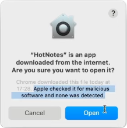

  

  <em>After downloading, open the file, and drag and drop the <code>HotNotes</code> app onto the <code>Applications</code> folder.</em>

# Intro

- Hot Notes is an app that opens your Apple Notes using fast fuzzy search
- The search window can be opened from anywhere using a keyboard shortcut.
- [These videos can also be watched on YouTube in a higher resolution](https://www.youtube.com/watch?v=UZsCDWJnOV0).

https://github.com/user-attachments/assets/252dd85b-2e64-4d60-a7d6-97af40216ad2

- Note: The videos have audio.
- Tip: When searching use the first two letters of each word. No space is needed.
	- E.g. Finding a note titled "Exporting Artwork", you can find it with "exar".
	- You can typically directly match the note you are looking for with a 4 letter search.

# Installing

https://github.com/user-attachments/assets/3038b680-dff5-437b-b0cb-54ee623769c7

# Create a keyboard shortcut to open Hot Notes

https://github.com/user-attachments/assets/564d0bff-d619-4335-9ebf-97eec93bec5f

- Note: You can also use an app called [Raycast](https://www.raycast.com/) to assign Hot Notes a global shortcut. Raycast seems to be more reliable and slightly faster to open apps than Apple Shortcuts.

# How Hot Notes differs from other Apple Note jumpers

- Stays fast with large numbers of folders and notes.
	- It has been tested with 10,000 folders and notes, and should perform ok with higher numbers.

- Fuzzy search.
	- This allows you to type just the first few letters of any words to find a match.

- No key logging.
	- Hot Notes uses the Apple Shortcuts program for launching, so it does not need to key log all of your keystrokes to watch for a keyboard shortcut.
	
- No full disk access.
	- Some of the other jumper programs use the Full Disk Access permission which lets them read and write all of your files and data on your Mac.
	- Hot Notes just requests access to the directory with your Apple Notes.
	
- Does not connect to the internet.
	- Hot Notes does not connect to the internet for any reason.

- Signed code only.
	- Hot Notes is [notarized](https://developer.apple.com/documentation/security/notarizing_macos_software_before_distribution) by Apple.
	- See [What is Apple Notarization](#what-is-apple-notarization).
	- Other apps have plugin systems which means they download new code that is not checked by Apple, and developers may not be verified.

# What is Apple Notarization

Hot Notes is [notarized](https://developer.apple.com/documentation/security/notarizing_macos_software_before_distribution) by Apple, which has the following benefits:

- It has been scanned and verified to be malware free.
- The app cannot be modified in any way, so the code that was checked by Apple is the code that runs.
- The developer ID is verified.
- Apple can remotely disable any apps found to contain malware in the future.

[*This is the message that confirms the app is notarized*](https://youtu.be/UZsCDWJnOV0?si=G0qNWjgRGeEY1DDr&t=75)

# FAQ

- Does Hot Notes change my Notes data?
	- No, Hot Notes only opens your Notes data in read-only mode.
	

- Is my data safe?
	- Hot Notes does not connect to the internet, so your Notes never leave your machine.
	- Hot Notes is a "signed" app which means there is no "code added later" dynamically that can change the "do not connect to the internet" logic.
	- Because of Apple's Notarization system, Apple can remotely delete signed apps from your Mac if they're later found to be malicious.
	- There are no auto-updates, updates occur manually by downloading the newer version from this page.
	

- How can I delete Hot Notes?
	- You can uninstall by deleting this folder: `/Applications/HotNotes.app`.
	

- Is it free?
	- Hot Notes is a fully functioning, time-unlimited free trial, with the occasional message to buy a license for continued use.
	- You can purchase a license by clicking the `About Hot Notes` menu item in the app.

- Does it take a lot of space on my Mac?
	- Hot Notes is less than 40MB, which is around the same size as ten photos.

- How can I contact you?
	- [Issues](https://github.com/emadda/hot-notes/issues) for bugs.
	- [Discussions](https://github.com/emadda/hot-notes/discussions) for feedback or feature requests.
	- [hotmatcha.dev](https://hotmatcha.dev).

